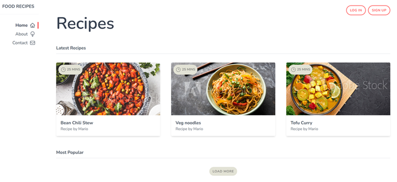

# Simple Webpage Using Tailwind CSS

## Overview
This is a basic webpage created to practice the fundamentals of **Tailwind CSS**, a utility-first CSS framework. It includes simple UI elements like a navbar, buttons, and cards, all styled using Tailwind's utility classes.

## Features
- **Responsive Layout** using Tailwind's responsive utilities.
- **Modern Design** with Tailwind's spacing, typography, and color utilities.

## Demo 
